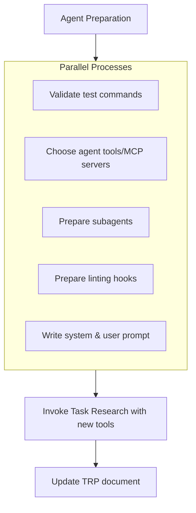

```mermaid
flowchart TD
    A[Agent Preparation] --> B[Parallel Preparation]

    subgraph B [Parallel Processes]
        B1[Validate test commands]
        B2[Choose agent tools/MCP servers]
        B3[Prepare subagents]
        B4[Prepare linting hooks]
        B5[Write system & user prompt]
    end

    B --> C[Invoke Task Research with new tools]
    C --> D[Update TRP document]

    click A "..\/index.md"
    click C "..\/Task_research\/index.md"
```
