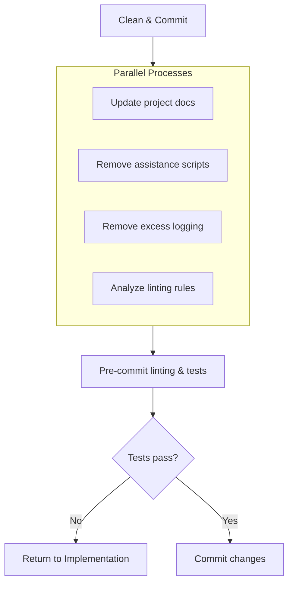

```mermaid
flowchart TD
    A[Clean & Commit] --> B[Parallel Cleanup]

    subgraph B [Parallel Processes]
        B1[Update project docs]
        B2[Remove assistance scripts]
        B3[Remove excess logging]
        B4[Analyze linting rules]
    end

    B --> C[Pre-commit linting & tests]
    C --> D{Tests pass?}
    D -->|No| E[Return to Implementation]
    D -->|Yes| F[Commit changes]

    click E "..\/index.md"
```
