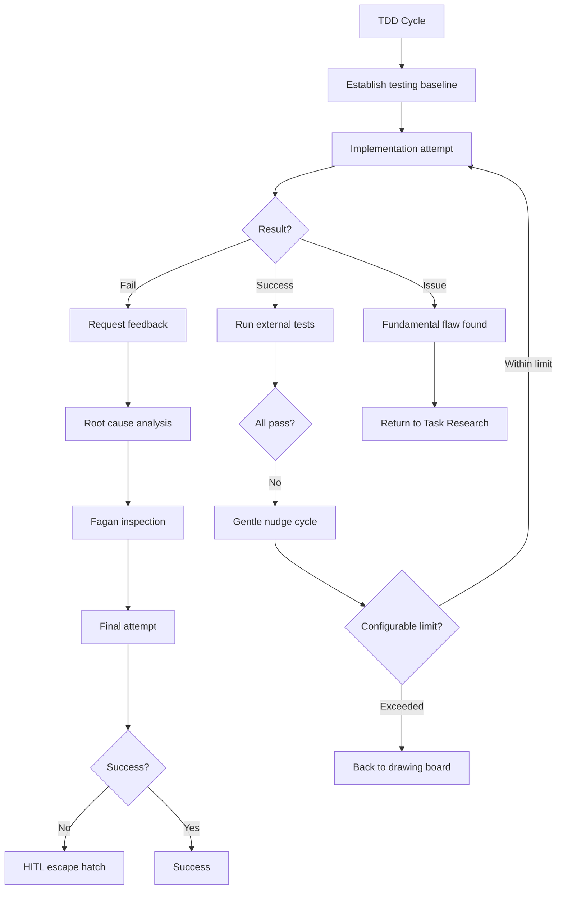

```mermaid
flowchart TD
    A[TDD Cycle] --> B[Establish testing baseline]
    B --> C[Implementation attempt]
    C --> D{Result?}

    D -->|Fail| E[Request feedback]
    E --> F[Root cause analysis]
    F --> G[Fagan inspection]
    G --> H[Final attempt]
    H --> I{Success?}
    I -->|No| J[HITL escape hatch]
    I -->|Yes| K[Success]

    D -->|Success| L[Run external tests]
    L --> M{All pass?}
    M -->|No| N[Gentle nudge cycle]
    N --> O{Configurable limit?}
    O -->|Within limit| C
    O -->|Exceeded| P[Back to drawing board]

    D -->|Issue| Q[Fundamental flaw found]
    Q --> R[Return to Task Research]

    click R "..\/Task_research\/index.md"
    click P "..\/Task_research\/index.md"
```
