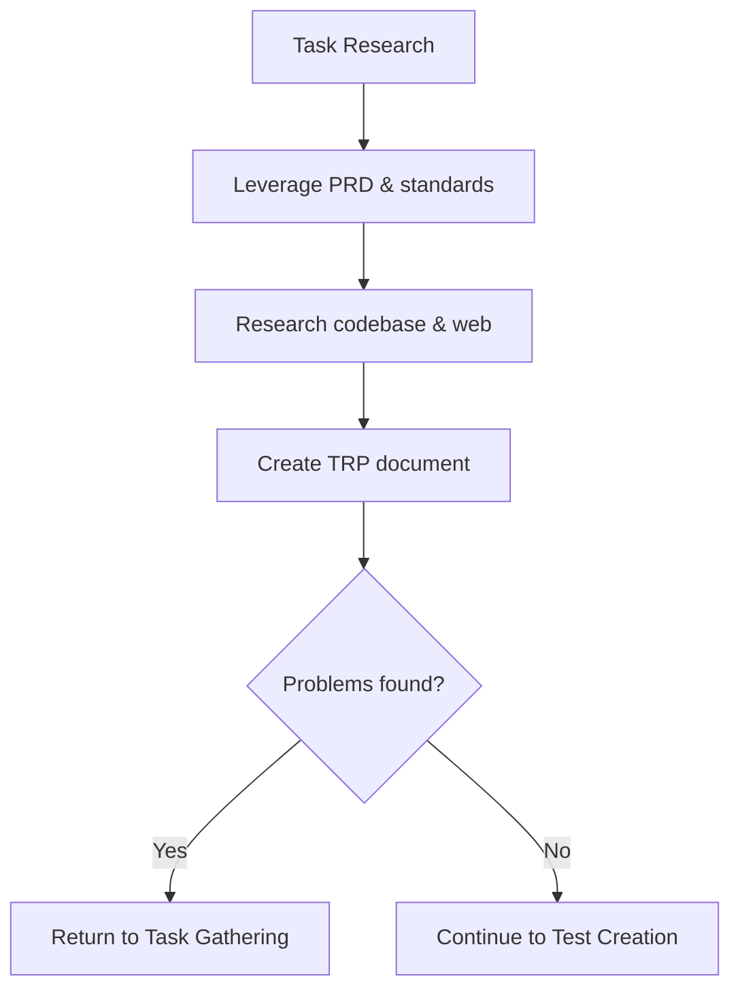

```mermaid
flowchart TD
    A[Task Research] --> B[Leverage PRD & standards]
    B --> C[Research codebase & web]
    C --> D[Create TRP document]
    D --> E{Problems found?}
    E -->|Yes| F[Return to Task Gathering]
    E -->|No| G[Continue to Test Creation]

    click F "..\/..\/Task_Breakdown\/Task_gathering\/index.md"
    click G "..\/Test_Creation\/index.md"
```
