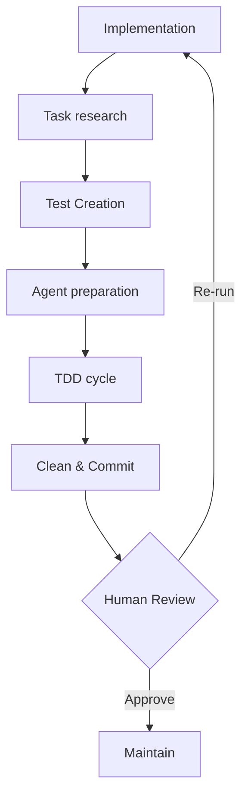

```mermaid
flowchart TD
    A[Implementation] --> B[Task research]
    B --> C[Test Creation]
    C --> D[Agent preparation]
    D --> E[TDD cycle]
    E --> F[Clean & Commit]
    F --> G{Human Review}
    G -->|Re-run| A
    G -->|Approve| H[Maintain]

    click B "./Task_research/index.md"
    click C "./Test_Creation/index.md"
    click D "./Agent_preparation/index.md"
    click E "./TDD_cycle/index.md"
    click F "./Clean_&_Commit/index.md"
    click H "../Maintain/index.md"
```
