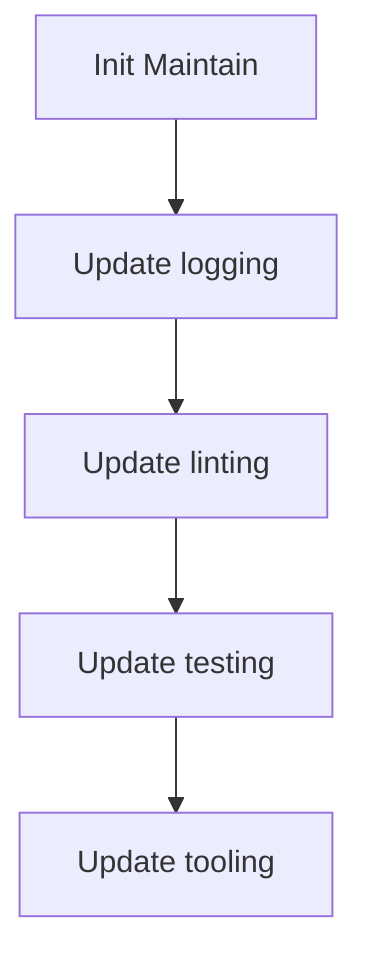

```mermaid
flowchart TD
    A[Init Maintain] --> B[Update logging]
    B --> C[Update linting]
    C --> D[Update testing]
    D --> E[Update tooling]

    click B "Update_logging\/index.md"
    click C "Update_linting\/index.md"
    click D "Update_testing\/index.md"
    click E "Update_tooling\/index.md"
```
