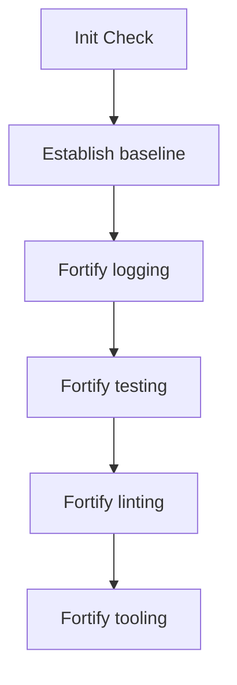

```mermaid
flowchart TD
    A[Init Check] --> B[Establish baseline]
    B --> C[Fortify logging]
    C --> D[Fortify testing]
    D --> E[Fortify linting]
    E --> F[Fortify tooling]

    click A "..\/index.md"
```
