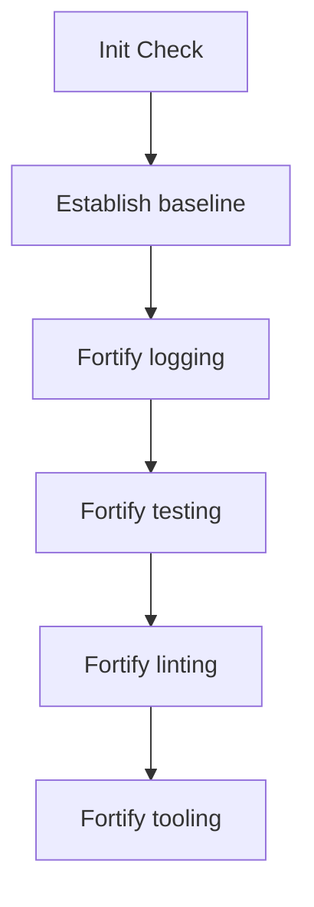

# Init_check

 Establish baseline and fortify project foundations

```mermaid
flowchart TD
    A[Init Check] --> B[Establish baseline]
    B --> C[Fortify logging]
    C --> D[Fortify testing]
    D --> E[Fortify linting]
    E --> F[Fortify tooling]

    click A "https://github.com/mulletware/hack/blob/main/Task_Breakdown/index.md"
```
