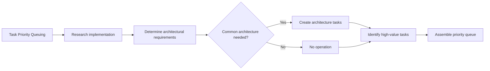

```mermaid
flowchart LR
    A[Task Priority Queuing] --> B[Research implementation]
    B --> C[Determine architectural requirements]
    C --> D{Common architecture needed?}
    D -->|Yes| E[Create architecture tasks]
    D -->|No| F[No operation]
    E --> G[Identify high-value tasks]
    F --> G
    G --> H[Assemble priority queue]

    click A "..\/index.md"
```
