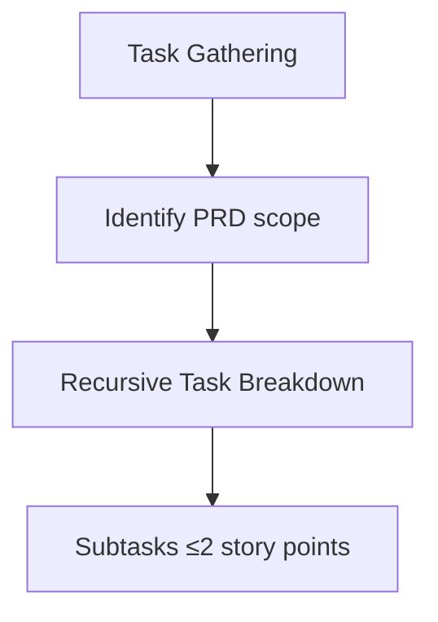

# Task_gathering

 Break down PRD into subtasks of 2 story points or less

```mermaid
flowchart TD
    A[Task Gathering] --> B[Identify PRD scope]
    B --> C[Recursive Task Breakdown]
    C --> D[Subtasks ≤2 story points]

    click A "https://github.com/mulletware/hack/blob/main/Task_Breakdown/index.md"
```
