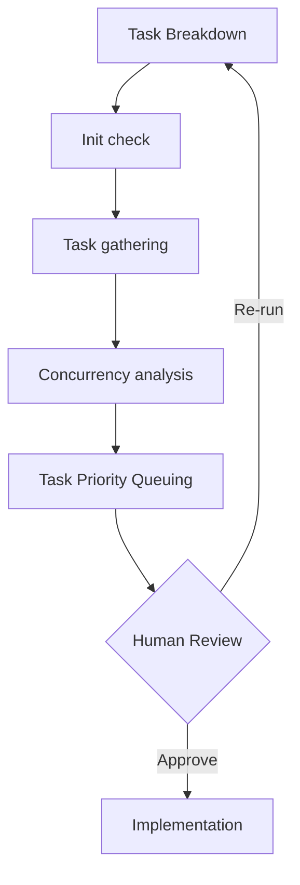

```mermaid
flowchart TD
    A[Task Breakdown] --> B[Init check]
    B --> C[Task gathering]
    C --> D[Concurrency analysis]
    D --> E[Task Priority Queuing]
    E --> F{Human Review}
    F -->|Re-run| A
    F -->|Approve| G[Implementation]

    click B "./Init_check/index.md"
    click C "./Task_gathering/index.md"
    click D "./Concurrency_analysis/index.md"
    click E "./Task_Priority_Queuing/index.md"
    click G "../Implementation/index.md"
```
